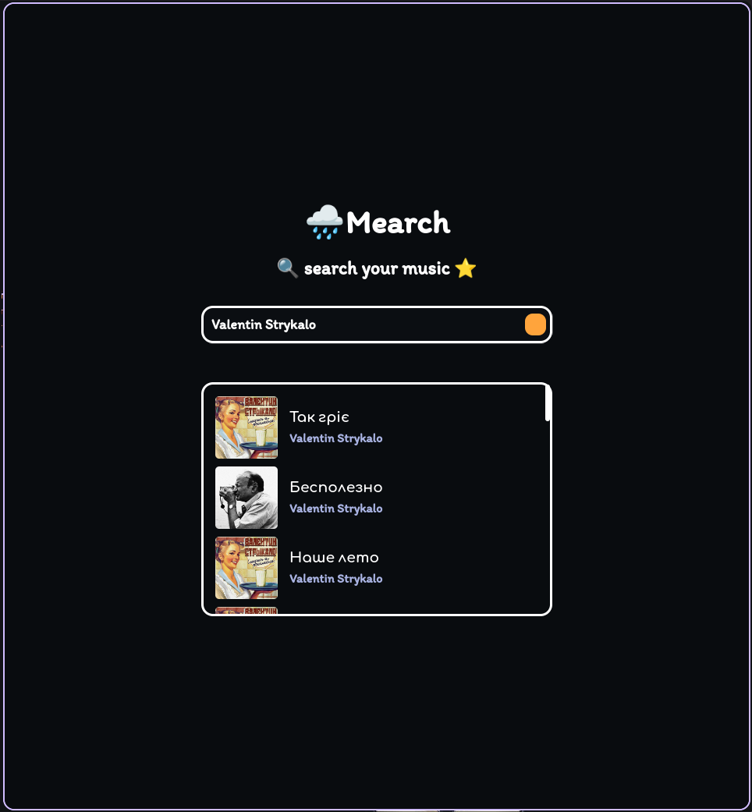

<div align="center">
<h1 align="center">Mearch🌧️</h1>
<h2 align="center">♫ Search and download your music ⭐</h2>

[](https://github.com/musdev13/mearch)
[](https://github.com/musdev13/mearch/releases/tag/v1.0.0)




screenshot :3

</div>

---

# Dependencies
## Build Dependencies
- Node JS
- npm
## Runtime Dependencies
- yt-dlp

# Build/Run
## Preparing
### Clone Repo

```sh
git clone --depth 1 https://github.com/musdev13/mearch.git
cd mearch
```

### Install npm Dependencies

```sh
npm i
```

## Run Dev
```sh
npm run dev
```

## Build
```sh
npm run build # build:win - for windows
```
check `dist_electron` folder for `.AppImage`*(for linux)* or `.exe`*(for windows)*